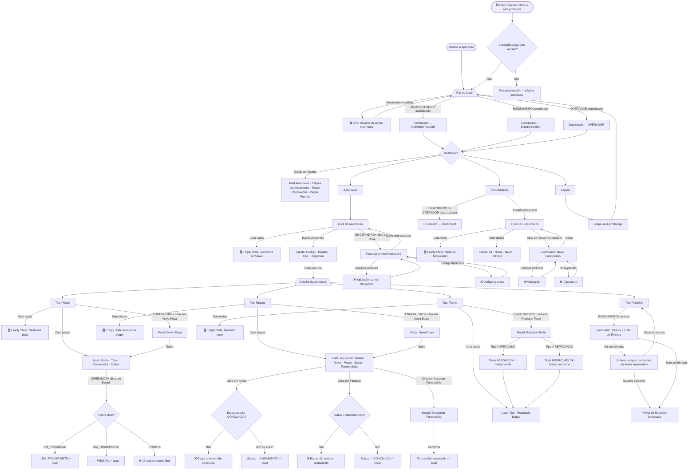

# SkyForge — User Flow Completo

## Fluxograma Principal

---

## Mapa de Telas × Níveis de Acesso

| Tela | OPERADOR | ENGENHEIRO | ADMINISTRADOR |
|---|:---:|:---:|:---:|
| Login (`/`) | ✅ | ✅ | ✅ |
| Dashboard (`/dashboard`) | ✅ | ✅ | ✅ |
| Lista Aeronaves (`/aeronaves`) | ✅ | ✅ | ✅ |
| Nova Aeronave (`/aeronaves/nova`) | ❌ redirect | ✅ | ✅ |
| Detalhe Aeronave (`/aeronaves/[codigo]`) | ✅ | ✅ | ✅ |
| → Tab Peças (ver) | ✅ | ✅ | ✅ |
| → Tab Peças (nova peça) | ❌ botão oculto | ✅ | ✅ |
| → Tab Peças (evoluir status) | ✅ | ✅ | ✅ |
| → Tab Etapas (ver) | ✅ | ✅ | ✅ |
| → Tab Etapas (nova etapa) | ❌ botão oculto | ✅ | ✅ |
| → Tab Etapas (iniciar/finalizar) | ✅ | ✅ | ✅ |
| → Tab Testes (ver) | ✅ | ✅ | ✅ |
| → Tab Testes (registrar) | ❌ botão oculto | ✅ | ✅ |
| → Tab Relatório | ❌ tab oculta | ✅ | ✅ |
| Funcionários (`/funcionarios`) | ❌ redirect | ❌ redirect | ✅ |
| Novo Funcionário (`/funcionarios/novo`) | ❌ redirect | ❌ redirect | ✅ |

---

## Regras de Negócio no Frontend

1. **Sequência de etapas:** A etapa N só pode ser iniciada se a etapa N-1 estiver `CONCLUIDA`
2. **Status de peça:** Só avança em ordem (`EM_PRODUCAO → EM_TRANSPORTE → PRONTA`); não regride
3. **Relatório com pendências:** Exibe aviso se houver etapas não `CONCLUIDA` ou testes `REPROVADO`
4. **Sessão:** Persistida em `sessionStorage`; ao fechar o navegador, a sessão é descartada
5. **Permissões:** Hierarquia `ADMINISTRADOR > ENGENHEIRO > OPERADOR`

---

## Credenciais Mockadas

| Usuário | Senha | Nível |
|---|---|---|
| `admin` | `admin123` | ADMINISTRADOR |
| `eng01` | `eng123` | ENGENHEIRO |
| `eng02` | `eng456` | ENGENHEIRO |
| `op01` | `op123` | OPERADOR |
